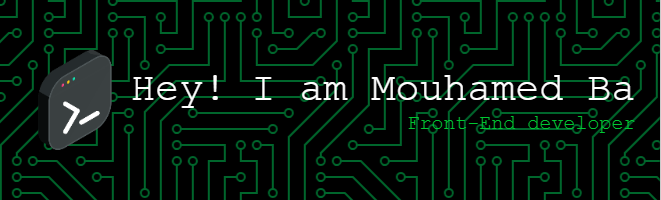

<h1 align="center">Hi 👋, I'm Mouhamed Ba</h2>

  

<h2>😎 À propos de moi</h2>

Je suis un étudiant en développement web et mobile, passionné par la technologie et désireux de plonger dans le domaine en constante évolution du développement de logiciels. J'aime créer des projets innovants et partager mes connaissances avec la communauté. J'aime aussi résoudre des problèmes difficiles et créer des solutions innovantes.

  

    <h2>👨🏾‍💻 CV</h2>
  

  

      

        <h2>👨🏾‍🎓 Formations</h2>
        - **3ème année de Licence en Informatique Développement d'Applications web et mobile** à **l'Université Numérique Cheikh Hamidou Kane** | En cours
        - **Baccalauréat Série S2** au **Lycée Banque Islamique** | 2020
      

  

  

    <h2>⚙ Technologies</h2>
    <h4>Langages</h4>
    
    
    
    
    <h4>Frameworks/Librairies</h4>
    
    
    
    
    
    
    
    <h4>Déploiment</h4>
    
    
    
    <h4>Design</h4>
    
    
    
    <h4>Autres</h4>
    
    
    
    
    
    
    
    
    
    
    
    
    
  

  

    <h2>🚀 Projets</h2>
    
  

